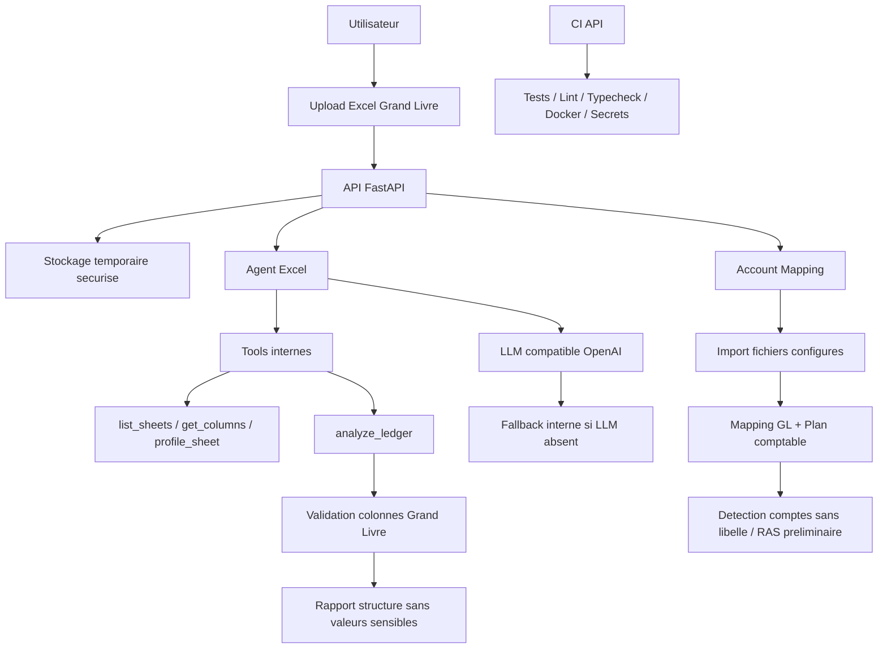
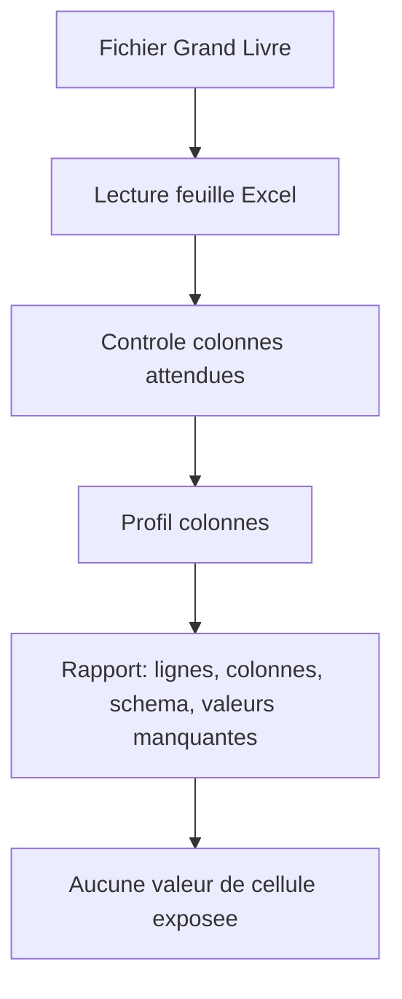
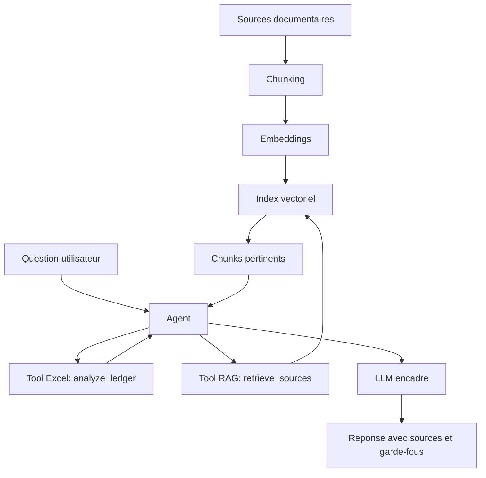

# Etat Actuel Du Projet

Resume: l'API sait recevoir un Excel, l'analyser, produire un mapping comptable et preparer l'agent LLM sans lui confier la decision fiscale.

## Detail `analyze_ledger`

## Agent, RAG Et Embeddings

