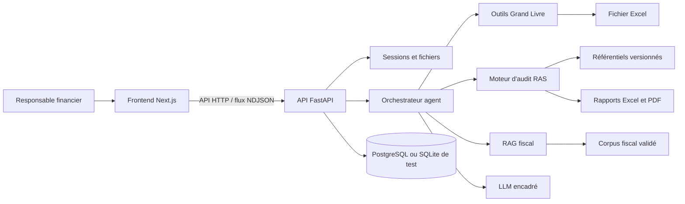
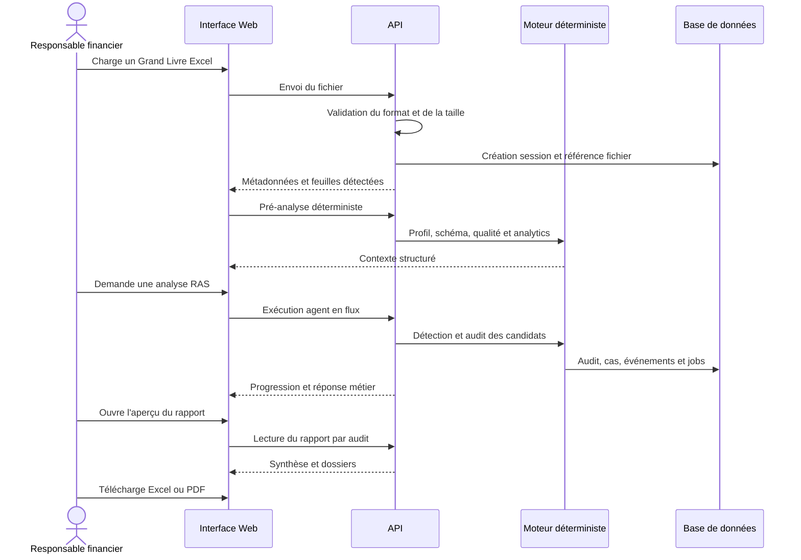

# Documentation générale du projet Fiscal Control Engine

> Document de référence pour la rédaction du rapport de stage  
> État du projet observé le 10 août 2026  
> Périmètre actif : audit pré-déclaratif de la retenue à la source (RAS) à partir du Grand Livre OHADA, avec un premier contexte d'application au Burkina Faso

## 1. Présentation générale

Fiscal Control Engine, encore désigné par le nom historique **Bank Files Harmonizer**, est une application d'aide à la revue fiscale pré-déclarative. Elle analyse un Grand Livre comptable afin d'identifier des opérations potentiellement soumises à la retenue à la source, de rechercher la retenue éventuellement comptabilisée et de préparer un rapport exploitable par un responsable financier.

L'application intervient avant l'établissement ou le dépôt d'une déclaration fiscale. Elle constitue un second niveau de contrôle interne : elle attire l'attention sur les dossiers à vérifier, présente les éléments comptables disponibles et indique les informations manquantes. Elle ne remplace ni le fiscaliste, ni l'expert-comptable, ni la décision du responsable financier.

Le projet repose sur une séparation fondamentale :

- le moteur déterministe analyse les données, sélectionne les règles versionnées et effectue les calculs ;
- le LLM orchestre certains outils et formule des explications compréhensibles ;
- le RAG recherche les passages juridiques utiles et leurs citations ;
- l'utilisateur conserve la décision fiscale finale.

## 2. Contexte et problématique

La revue manuelle d'un Grand Livre volumineux est longue et expose l'entreprise à plusieurs difficultés :

- hétérogénéité des noms de colonnes et des formats transmis par les logiciels comptables ;
- nombre important d'écritures et de pièces à examiner ;
- difficulté à repérer les opérations susceptibles de relever de la RAS ;
- difficulté à reconstituer une pièce comptable complète à partir de lignes dispersées ;
- évolution annuelle des textes fiscaux, des taux et des périodes d'application ;
- nécessité de justifier chaque résultat par une trace comptable et une source juridique ;
- risque d'obtenir une réponse plausible mais incorrecte si une IA générative décide seule.

Le projet répond à cette problématique par une chaîne de traitement traçable. Il transforme un fichier comptable en une population de dossiers de contrôle, sans transformer automatiquement un simple signal en conclusion fiscale.

## 3. Objectifs

### 3.1 Objectif principal

Fournir au responsable financier une synthèse compréhensible des risques ou vérifications RAS identifiés dans le Grand Livre, avec les preuves disponibles, les limites de l'analyse et les actions recommandées.

### 3.2 Objectifs fonctionnels

- importer et valider un fichier Excel de Grand Livre ;
- reconnaître les colonnes comptables malgré des intitulés variables ;
- analyser la structure et la qualité des données ;
- détecter largement les pièces potentiellement concernées par la RAS ;
- expliquer les motifs de détection en français métier ;
- reconstituer les écritures d'une pièce sélectionnée ;
- rechercher une contrepartie RAS et les régularisations disponibles ;
- appliquer une règle juridique uniquement lorsque les faits requis sont établis ;
- calculer un montant théorique de manière déterministe ;
- classer les dossiers selon leur état, leur priorité et l'action attendue ;
- générer un aperçu et des rapports Excel ou PDF ;
- permettre des questions en langage naturel sur le Grand Livre ou le corpus fiscal.

### 3.3 Objectifs non fonctionnels

- traçabilité et reproductibilité des traitements ;
- absence de décision fiscale confiée au LLM ;
- isolation des sessions, fichiers, audits et candidats ;
- limitation de l'exposition des données sensibles ;
- comportement explicite en cas de données ou de sources manquantes ;
- tests automatisés, typage strict et intégration continue ;
- environnement local reproductible avec Docker.

## 4. Périmètre fonctionnel

### 4.1 Périmètre actif

Le périmètre prioritaire porte sur l'audit RAS fondé sur le **Grand Livre uniquement**. Aucun référentiel fournisseur externe ni aucune déclaration fiscale ne sont nécessaires pour lancer la détection.

Cette limite influence directement la portée des résultats. Si aucune contrepartie RAS n'est trouvée, le système peut indiquer « RAS non retrouvée dans le Grand Livre analysé ». Il ne peut pas en déduire qu'une déclaration fiscale a été omise.

### 4.2 Périmètre historique conservé

Des fonctions d'analyse de déclarations TVA, RAS, IUTS et IS existent encore sous `/api/tax-declarations/**` ainsi que dans la page front `/declarations`. Elles sont conservées pour compatibilité, mais sont gelées hors correctif critique et ne constituent pas le cœur actuel du produit.

### 4.3 Hors périmètre actuel

- établissement et télétransmission d'une déclaration fiscale définitive ;
- décision automatique d'assujettissement ;
- remplacement d'une validation humaine ou juridique ;
- rapprochement systématique avec les déclarations, factures, contrats et paiements externes ;
- conversion implicite entre devises ;
- activation automatique d'une nouvelle loi collectée sur le Web.

## 5. Utilisateurs et rôles

Le principal utilisateur visé est le **Responsable Financier**. Il charge le Grand Livre, consulte les indicateurs, interroge l'assistant, analyse les pièces détectées et télécharge le rapport.

Deux rôles complémentaires sont prévus dans la feuille de route :

- le fiscaliste ou expert métier, qui valide les interprétations, les règles et les sources ;
- l'administrateur, qui importe, compare, archive et soumet à validation les nouvelles sources fiscales.

L'espace d'administration des sources n'est pas encore implémenté.

## 6. Architecture générale



L'application comprend trois couches principales :

1. **Frontend** : interface de chargement, chat, analytics, consultation et export du rapport.
2. **Backend** : API, orchestration, outils Excel, moteur RAS, RAG, persistance et exports.
3. **Référentiels documentaires** : mappings comptables, signaux, règles juridiques, paramètres de calcul et corpus fiscal versionnés dans `docs/`.

## 7. Technologies utilisées

| Couche | Technologies principales | Rôle |
| --- | --- | --- |
| Backend | Python 3.12, FastAPI, Pydantic | API et contrats typés |
| Données Excel | Pandas, OpenPyXL | lecture, normalisation et export Excel |
| PDF et OCR | pypdf, pypdfium2, Pillow, Tesseract | lecture documentaire et génération/validation PDF |
| Persistance | SQLAlchemy, PostgreSQL, Alembic | sessions, exécutions, audits et migrations |
| Frontend | Next.js 16, React 19, TypeScript | application Web |
| Interface | Tailwind CSS, Framer Motion | présentation et animations |
| Données frontend | TanStack Query, Zustand | appels API et état local |
| Graphiques | Recharts | indicateurs et visualisations du Grand Livre/RAS |
| Qualité backend | Pytest, Ruff, mypy strict | tests, lint et typage |
| Qualité frontend | Vitest, Testing Library, ESLint, TypeScript | tests et contrôles statiques |
| Exécution | Docker Compose, uv, npm | environnement local reproductible |
| CI | GitHub Actions | contrôles automatiques à chaque changement concerné |

Les embeddings reposent sur une dépendance optionnelle `sentence-transformers`. Ils ne sont pas installés dans l'image de développement minimale et le classificateur sémantique est désactivé par défaut tant que sa calibration n'est pas validée.

## 8. Organisation du dépôt

```text
fiscal-control-engine-main/
├── api/                       API FastAPI et cœur métier
│   ├── app/
│   │   ├── agent/             orchestration et outils de l'agent
│   │   ├── agent_file/        validation et stockage temporaire des fichiers
│   │   ├── agent_persistence/ persistance sessions, runs, événements et audits
│   │   ├── excel_agent/       outils génériques d'analyse Excel
│   │   ├── ledger_analysis/   analyse déterministe du Grand Livre
│   │   ├── llm/               fournisseurs LLM et fallback contrôlé
│   │   ├── rag_source/        chargement, découpage et embeddings documentaires
│   │   ├── ras_audit/         détection, règles, calcul, rapprochement et rapports
│   │   ├── routers/           routes HTTP
│   │   └── tax_declaration/   ancien périmètre déclaratif gelé
│   ├── migrations/            migrations Alembic
│   ├── scripts/               vérifications et scripts de maintenance
│   └── tests/                 tests d'intégration et de contrats
├── front/                     frontend Next.js
│   ├── app/                   pages et routes
│   ├── api/                   client API typé
│   ├── components/            composants métier et d'interface
│   └── hooks/                 hooks React Query
├── docs/                      documentation, corpus et référentiels
├── .github/workflows/         intégration continue
├── docker-compose.yml         API, PostgreSQL et volumes
└── package.json               commandes communes du projet
```

## 9. Parcours utilisateur principal



### 9.1 Chargement du fichier

L'upload est volontairement séparé de l'analyse. Le serveur valide le format, la taille maximale configurée à 20 Mo et la lisibilité générale du classeur. Il enregistre ensuite une référence opaque liée à la session. Le fichier est stocké temporairement, avec une durée de vie par défaut de 24 heures.

Le frontend affiche le nom, la taille, les feuilles détectées et un message compréhensible en cas d'erreur. Le choix manuel d'une feuille lorsque le classeur en contient plusieurs reste à réaliser.

### 9.2 Pré-analyse

Après l'upload, une pré-analyse déterministe prépare silencieusement le contexte : structure du classeur, colonnes, qualité, volumes et graphiques. Elle ne produit pas artificiellement un message de l'assistant avant que l'utilisateur pose sa question.

### 9.3 Conversation

L'utilisateur peut poser une question avec ou sans fichier. L'interface appelle en priorité le flux `POST /api/agent/runs/stream`, qui restitue les étapes d'exécution au fur et à mesure. Un endpoint non streamé reste disponible. Les conversations et fichiers sont visibles dans la barre latérale ; une conversation peut être supprimée après confirmation, sans supprimer automatiquement le fichier ou les audits associés.

### 9.4 Exploration et rapport

Les indicateurs présentent notamment les comptes, périodes, classes OHADA, débits/crédits, devises, qualité des données et candidats RAS. La liste dépliable des détections par libellé affiche la référence comptable réelle, la date, le compte, le libellé, le montant et le motif de détection.

L'aperçu de rapport se trouve sur une page dédiée : `/rapports/ras/[auditId]`. L'interface propose actuellement les téléchargements Excel et PDF.

## 10. Traitement du Grand Livre

### 10.1 Normalisation

Le moteur reconnaît les alias de colonnes définis dans un référentiel CSV. Il normalise notamment les références de pièce, comptes, libellés, dates, montants, devises, fournisseurs et clients tout en conservant leur provenance.

Les colonnes fournisseur et client sont traitées séparément. Si deux tiers différents sont présents sur une même ligne, le système crée une anomalie au lieu d'en choisir un arbitrairement.

### 10.2 Évaluation de la qualité

La préparation du Grand Livre contrôle les informations nécessaires à chaque capacité : colonnes présentes, dates, montants, devise, société, identifiants de pièce, numéros de ligne, doublons, clés de comptabilisation et cohérence à l'intérieur d'une pièce.

Une donnée absente ne bloque que les capacités qui en dépendent. Par exemple, l'absence de périmètre société peut empêcher une conclusion ferme sur la contrepartie sans empêcher la détection initiale des candidats.

### 10.3 Outils disponibles

Les outils génériques permettent de :

- lister les feuilles et les colonnes ;
- profiler une feuille ;
- classifier le schéma comptable ;
- analyser le Grand Livre ;
- filtrer et paginer des écritures ;
- agréger des mouvements ;
- détecter des problèmes de qualité ;
- détecter des candidats fiscaux ou spécifiquement RAS.

Les résultats numériques et structurés sont produits par ces outils, pas par le LLM.

## 11. Moteur d'audit RAS

### 11.1 Détection des candidats

La détection combine plusieurs familles de signaux :

- comptes comptables configurés comme pertinents ;
- texte du libellé de l'écriture ou de la pièce ;
- journal ou type de pièce lorsqu'ils sont disponibles ;
- date, devise et montant ;
- clé de comptabilisation et sens débit/crédit ;
- structure des lignes partageant la même pièce ;
- signaux sémantiques optionnels.

Un candidat détecté n'est pas automatiquement assujetti. Le résultat conserve le motif, les preuves, les exclusions et les informations à vérifier. Cette distinction évite qu'un « signal sémantique fort » soit présenté comme une conclusion fiscale.

### 11.2 Reconstitution de la pièce

`reconstruct_accounting_entry` regroupe les lignes qui appartiennent à une même pièce à partir des identifiants disponibles. Il restitue les comptes, débits, crédits, dates, tiers et devises nécessaires à l'analyse.

### 11.3 Recherche de la contrepartie

`find_ras_counterpart` cherche les comptes RAS configurés dans la pièce, puis les régularisations ou extournes liées. La priorité est donnée à l'identifiant de pièce, puis au journal, à la société, à l'exercice, à la date, au tiers et à la devise.

Le système n'effectue pas de rapprochement inter-devise implicite. Il n'affirme une absence que lorsque la couverture technique du fichier, le mapping des comptes et les fenêtres de recherche sont suffisants.

### 11.4 Résolution juridique

`resolve_applicable_ras_rule` sélectionne une règle versionnée à partir de faits attestés : nature de l'opération, résidence, IFU, exemption éventuelle, date applicable, fait générateur et autres conditions requises.

En cas de source manquante, contradiction, chevauchement ou faits insuffisants, la résolution reste indéterminée. Le système ne choisit pas la règle « la plus probable » pour produire artificiellement un résultat.

### 11.5 Calcul déterministe

`calculate_theoretical_ras` utilise `Decimal` et les paramètres versionnés. Le calcul n'est autorisé qu'après résolution unique de la règle, validation de l'assiette, du fait générateur et de la devise. Aucun prorata, arrondi ou taux n'est inventé lorsque le référentiel ne le prévoit pas.

### 11.6 Évaluation comptable

`assess_ras_accounting` compare, pour un même candidat :

- le montant théorique déterminé par la règle ;
- le montant comptabilisé trouvé dans le Grand Livre ;
- l'écart, défini comme `comptabilisé - théorique` ;
- la tolérance applicable ;
- les preuves et limites du contrôle.

Les états métier couvrent notamment les cas conformes, montants incohérents, retenues non retrouvées, applicabilités à confirmer et dossiers indéterminables faute de données.

### 11.7 Orchestration et machine d'états

Chaque candidat évolue selon une machine d'états contrôlée par le serveur :

```text
detected
  -> awaiting_facts
  -> rule_resolved
  -> calculated
  -> counterpart_assessed
  -> reported

À toute étape : blocked ou failed
```

Le serveur impose l'ordre et les préconditions. Le LLM peut exprimer une intention d'outil, mais il ne peut pas choisir les montants, les règles ou les données intermédiaires transmis à l'étape suivante.

Le traitement multi-candidats utilise des jobs unitaires idempotents, une concurrence bornée, des reprises après interruption et un digest d'entrée empêchant un double traitement identique. Une limite serveur de 5 000 candidats par défaut, configurable jusqu'à 20 000, protège le traitement en lot.

### 11.8 Gestion des faits manquants

Un candidat passe en attente lorsque des faits obligatoires manquent. La demande de clarification est structurée et limitée aux informations nécessaires. Les faits ajoutés produisent une nouvelle version immuable de l'audit. Leur contexte est signé par HMAC et expire afin d'éviter une modification ou une réutilisation non contrôlée.

## 12. LLM : rôle et garde-fous

Le projet accepte une chaîne de fournisseurs configurables : fallback interne contrôlé, endpoint compatible OpenAI, Gemini ou Groq. Les clés et URLs sont injectées par configuration et ne sont pas codées dans le dépôt.

Le LLM est utilisé pour :

- comprendre l'intention de la question ;
- sélectionner une famille d'outils autorisée ;
- expliquer en français métier un résultat déjà calculé ;
- reformuler les preuves, limites et informations manquantes ;
- proposer une interprétation non décisionnelle de libellés ambigus.

Il ne doit jamais :

- sélectionner librement un taux fiscal ;
- inventer une base, un montant, une date ou une règle ;
- déclarer une opération conforme ou non conforme sans résultat déterministe ;
- transformer un échec technique en conclusion fiscale ;
- affirmer que le Grand Livre fourni couvre toute l'organisation.

Lorsque le fournisseur externe est absent ou échoue, une réponse interne contrôlée permet au parcours de rester fonctionnel. Un smoke test réel du fournisseur compatible OpenAI reste à réaliser dans l'environnement cible.

## 13. RAG fiscal et citations

### 13.1 Finalité

Le RAG permet de retrouver des passages pertinents dans le CGI, les lois de finances et les documents fiscaux officiels. Il sert à répondre à une question juridique avec citation et à soutenir la revue du référentiel de règles.

Le texte récupéré n'est jamais exécuté directement comme une règle fiscale.

### 13.2 Corpus et métadonnées

Les sources Markdown du corpus fiscal se trouvent dans `docs/source-corpus/fiscal/`. Chaque source doit décrire son pays, son type, son titre, sa version, sa période d'application, son article ou sa section, son URL officielle et son empreinte.

Le corpus contient des documents thématiques et des lois de finances, dont la version 2026 est la loi de finances active dans la recherche actuelle. La présence d'un document dans le dépôt ne vaut toutefois pas validation juridique définitive.

### 13.3 Recherche actuelle

`query_tax_rag` effectue une recherche lexicale locale dans les sources validées. Un provider `sentence-transformers` peut reranger des résultats qui possèdent déjà une ancre lexicale. Le mode sémantique ne peut donc pas contourner l'absence de preuve textuelle.

Chaque résultat comporte le passage borné, le document, l'article ou la section, la version, l'URL, l'empreinte SHA-256, le score et l'applicabilité à la date demandée.

Le système doit refuser une réponse forte lorsqu'aucun passage pertinent n'est trouvé, lorsque les sources se contredisent ou lorsque la question sort du corpus.

### 13.4 Mise à jour annuelle des lois

La chaîne complète de mise à jour n'est pas encore construite. L'architecture prévue comprend :

1. import manuel d'un PDF ou d'une URL officielle depuis une interface réservée ;
2. contrôle du domaine, du type de fichier, de la taille et des doublons ;
3. téléchargement et conservation de la provenance ;
4. extraction du texte et découpage par article/section ;
5. comparaison avec la version précédente ;
6. détection des contradictions ou périodes qui se chevauchent ;
7. revue et correction par un fiscaliste habilité ;
8. validation explicite avec motif ;
9. activation versionnée et archivage de l'ancienne version ;
10. réindexation du RAG et tests de non-régression.

Une source découverte sur le Web ne devra jamais devenir active automatiquement.

## 14. Persistance et traçabilité

La couche SQLAlchemy utilise PostgreSQL en environnement Docker et peut utiliser SQLite pour certains tests isolés. Les principales tables sont :

| Table | Contenu |
| --- | --- |
| `agent_sessions` | session, expiration, statut et fichier actif |
| `agent_files` | métadonnées, feuilles, chemin protégé et expiration du fichier |
| `agent_runs` | question, réponse, fournisseur et modèle |
| `agent_messages` | messages utilisateur et assistant |
| `agent_run_events` | progression ordonnée de l'exécution |
| `agent_tool_results` | résultats structurés et erreurs des outils |
| `ras_audit_runs` | version d'audit, hash source, statut et versions des référentiels |
| `ras_audit_cases` | état, certitude et payload de chaque candidat |
| `ras_audit_events` | historique immuable des transitions |
| `ras_audit_candidate_jobs` | traitement, tentatives, reprise et idempotence par candidat |

Chaque audit enregistre l'empreinte SHA-256 du Grand Livre et les versions des référentiels utilisés. Une correction de faits crée un audit enfant au lieu de modifier l'historique.

## 15. API principale

L'API FastAPI est préfixée par `/api`. Ses groupes fonctionnels sont :

| Groupe | Fonctions principales |
| --- | --- |
| `/api/health` | état de disponibilité de l'API |
| `/api/agent/files` | upload et liste des fichiers d'une session |
| `/api/agent/conversations` | liste, détail et suppression des conversations |
| `/api/agent/sessions/{id}/context` | contexte et analytics d'une session |
| `/api/agent/runs` | exécution synchrone de l'agent |
| `/api/agent/runs/stream` | exécution en flux NDJSON |
| endpoints d'audit RAS | statut du workflow, traitement et annulation des candidats |
| endpoints de rapport RAS | aperçu, génération et téléchargement CSV/JSON/XLSX/PDF côté API |
| `/api/account-mappings` | consultation et création de mappings |
| `/api/tax-declarations/**` | ancien périmètre déclaratif déprécié |

Le frontend ne présente que les formats Excel et PDF, même si les contrats API CSV et JSON sont maintenus pour compatibilité.

## 16. Rapports d'audit

### 16.1 Aperçu Web

L'aperçu s'adresse à un profil financier. Il présente les indicateurs de synthèse et les dossiers sous forme de tableau sur ordinateur ou de cartes sur mobile. Les références de pièces comptables réelles sont affichées dans cet espace lié à la session et à l'audit.

Une validation ergonomique sur un audit réel par un profil finance reste nécessaire avant de figer la présentation.

### 16.2 Rapport Excel

Le classeur Excel comprend trois feuilles :

- **Synthese** : indicateurs exécutifs et causes principales ;
- **Anomalies** : dossiers exigeant une revue ;
- **Dossiers incomplets** : cas non calculables et informations attendues.

Les colonnes utilisent des libellés français métier. Le rapport présente notamment la référence réelle, la période, le compte, la nature, le statut, la priorité, l'action proposée, les montants par devise, l'écart, les informations manquantes et une explication concise.

La feuille « Références juridiques » a été retirée du classeur. Les identifiants techniques (`candidate_id`, `rule_id`, versions et codes internes) ne sont pas affichés dans les feuilles destinées au métier.

### 16.3 Rapport PDF

Le PDF fournit une synthèse lisible destinée au partage et à la décision. Il n'est pas conçu comme un export technique exhaustif de tous les candidats.

### 16.4 Confidentialité selon le canal

Les exports Excel et l'aperçu présentent la référence comptable réelle afin de permettre la vérification opérationnelle. Les exports API publics JSON/CSV conservent une référence de pièce pseudonymisée. Les références fournisseurs restent minimisées ou pseudonymisées selon le contrat.

## 17. Frontend

La page principale combine :

- une barre latérale avec nouveau chat, conversations, recherche et fichiers ;
- une zone centrale de conversation et d'upload ;
- une colonne analytics avec indicateurs et graphiques ;
- une vue agrandie du contrôle RAS ;
- une page dédiée à l'aperçu du rapport.

Les réponses de l'agent sont formatées en Markdown simple. Les codes techniques, indicateurs de périmètre et catégories anglaises ont été remplacés ou masqués dans les rendus utilisateur. Les statistiques globales peu interprétables, comme moyenne/minimum/maximum des mouvements, ne sont plus affichées dans la synthèse conversationnelle.

Les améliorations frontend encore prévues concernent principalement : sélection de feuille, restitution structurée et paginée des écritures, résultats de mapping et anomalies, détail d'un candidat, chat RAG juridique et administration des sources.

## 18. Sécurité et confidentialité

Les mécanismes déjà présents comprennent :

- validation du type, de la taille et de la lisibilité des fichiers à l'entrée ;
- stockage temporaire sous une racine autorisée ;
- références de fichiers opaques au lieu de chemins fournis au LLM ;
- durée de vie limitée des fichiers et des sessions ;
- isolation des résultats par session, fichier, audit et candidat ;
- empreintes SHA-256 des sources et des Grand Livres ;
- contexte des faits signé par HMAC ;
- erreurs techniques transformées en codes et messages publics génériques ;
- limitation de la taille des réponses et des traitements en lot ;
- scanner de secrets dans l'intégration continue ;
- minimisation des cellules, libellés, tiers et montants transmis au LLM ;
- interdiction architecturale d'envoyer le Grand Livre au RAG documentaire.

Limite importante : le code observé définit l'isolation logique par session et identifiants, mais ne montre pas encore un système complet d'authentification, de rôles et d'autorisations de production. Le chiffrement renforcé des données fiscales sensibles et la gouvernance des accès restent à finaliser avant une exploitation réelle.

## 19. Tests, qualité et intégration continue

### 19.1 Backend

Le backend est soumis à :

- Ruff pour le lint ;
- mypy en mode strict ;
- Pytest pour les tests unitaires et d'intégration ;
- compilation des sources Python ;
- construction de l'image Docker ;
- contrôle des secrets versionnés.

La validation consignée le 10 août 2026 indique :

- Ruff réussi ;
- mypy strict réussi sur 294 fichiers ;
- 785 tests Pytest réussis dans un conteneur isolé ;
- 33 tests ciblés d'orchestration RAS réussis ;
- rejeu d'un Grand Livre anonymisé de 2 500 lignes : 2 205 pièces évaluées et 611 candidates ;
- rapport identique après régénération, conformément à l'objectif de reproductibilité.

Ces chiffres sont un état daté et doivent être réactualisés dans le rapport de stage après toute évolution de la suite.

### 19.2 Frontend

Le frontend est contrôlé par ESLint, TypeScript, Vitest et le build Next.js de production. Des tests ciblent notamment le rendu Markdown, les résultats RAS, les boutons de rapport, l'aperçu et les contrats du client API.

### 19.3 CI

Le workflow GitHub Actions `Quality` exécute sur les changements concernés :

1. recherche de secrets committés ;
2. installation Python avec `uv` ;
3. lint, typage, tests et compilation API ;
4. build Docker de l'API ;
5. installation Node avec `npm ci` ;
6. lint, typage, tests et build frontend.

Une stratégie de déploiement continu n'est pas encore définie.

## 20. Installation et lancement local

### 20.1 Prérequis

- Docker Desktop avec Docker Compose ;
- Node.js 22 ou supérieur et npm 10 ou supérieur pour lancer le frontend hors Docker ;
- un fichier `api/.env` dérivé de la configuration d'exemple ;
- les secrets fournisseurs uniquement si un LLM externe doit être utilisé.

### 20.2 Backend et base de données

Depuis la racine du projet :

```bash
docker compose up api
```

L'API est disponible sur `http://localhost:8001` et PostgreSQL sur le port local `5433`.

Pour redémarrer uniquement le conteneur API sans reconstruire l'image :

```bash
docker compose restart api
```

### 20.3 Frontend

```bash
cd front
npm install
npm run dev
```

Le frontend est disponible sur `http://localhost:3002`. Son proxy transmet les requêtes `/api/*` à `http://localhost:8001/api/*` par défaut.

### 20.4 Contrôles de qualité

Depuis la racine :

```bash
npm run quality
```

Les contrôles peuvent également être lancés séparément avec `npm run api:test`, `npm run api:lint`, `npm run api:typecheck`, `npm run front:test`, `npm run front:lint`, `npm run front:typecheck` et `npm run front:build`.

## 21. Configuration importante

Les paramètres sont centralisés dans `api/app/config.py` et fournis par variables d'environnement. Les principaux groupes sont :

- connexion `DATABASE_URL` ;
- origines CORS ;
- racine et durée de vie des fichiers ;
- taille maximale d'upload ;
- chemins des mappings et référentiels RAS ;
- limite du batch de candidats ;
- clé de signature des faits ;
- racine du corpus RAG et provider d'embeddings ;
- chaîne de fournisseurs LLM, clés, URL, timeout et limite de sortie.

La valeur de développement de la clé HMAC fournie par Docker Compose doit impérativement être remplacée dans un environnement réel.

## 22. État d'avancement

| Domaine | État | Commentaire |
| --- | --- | --- |
| Upload et stockage temporaire | Opérationnel | validation, métadonnées, expiration et rattachement session |
| Analyse et analytics du GL | Opérationnel avec compléments | nombreux indicateurs ; sélection de feuille et certaines restitutions structurées à terminer |
| Détection des candidats RAS | Opérationnel | détection explicable par compte, texte et signaux configurés |
| Reconstitution et contrepartie | Opérationnel | preuves et limites restituées ; challenge des cas complexes à poursuivre |
| Orchestration RAS | Implémentée | machine d'états, jobs, reprise, idempotence et isolation testées |
| Règles et calcul déterministes | Implémentés, validation métier incomplète | matrice et sources à compléter et faire relire par un expert |
| Rapport Excel/PDF | Opérationnel | aperçu dédié, Excel métier à trois feuilles et synthèse PDF |
| Agent conversationnel | Opérationnel | stream, fallback et réponses françaises ; tests adversariaux à poursuivre |
| RAG fiscal | Fonctionnel mais non finalisé | lexical local et citations ; non-régression et chaîne de mise à jour à construire |
| Embeddings sémantiques | Expérimental/désactivé par défaut | calibration sur données représentatives nécessaire |
| Administration des sources | Non implémentée | parcours d'import, comparaison, validation et activation à construire |
| Anciennes déclarations | Implémentées mais gelées | compatibilité uniquement |
| CI qualité | Opérationnelle | lint, types, tests, build, compilation et secrets |
| Déploiement production | Non défini | CD, authentification, chiffrement et observabilité à concevoir |

## 23. Travaux réalisés et apports techniques

Les principaux acquis du projet sont :

- création d'une API FastAPI modulaire et strictement typée ;
- mise en place d'une ingestion Excel sécurisée ;
- normalisation des variantes de Grand Livre OHADA ;
- séparation nette entre détection, résolution juridique, calcul et explication ;
- externalisation et versionnement des référentiels métier en CSV ;
- orchestration RAS de bout en bout avec états, reprise et idempotence ;
- persistance des conversations, outils, audits et traces ;
- développement d'un frontend React/Next.js orienté responsable financier ;
- création d'analytics et de listes de pièces directement vérifiables ;
- conception d'un rapport Excel métier et d'une synthèse PDF ;
- francisation et simplification des rendus techniques ;
- ajout d'une architecture RAG avec citations et refus hors source ;
- stabilisation des tests backend sous Docker/Windows ;
- automatisation de la qualité avec GitHub Actions.

Dans un rapport de stage, ces travaux peuvent être présentés autour de quatre axes : **ingénierie des données comptables**, **fiabilité de la décision fiscale**, **intégration raisonnée de l'IA** et **industrialisation de la qualité logicielle**.

## 24. Limites actuelles

### 24.1 Limites métier

- le Grand Livre seul ne prouve pas l'exhaustivité des opérations de l'entreprise ;
- certains faits juridiques ne sont pas présents dans la comptabilité ;
- le mapping des comptes RAS dépend de chaque organisation ;
- les sources et règles doivent encore être validées exhaustivement par un expert ;
- les résultats « potentiels » et « indéterminables » nécessitent une revue humaine.

### 24.2 Limites techniques

- performances non encore qualifiées sur de très grands Grand Livres ;
- classificateur sémantique non calibré pour une activation par défaut ;
- tests incomplets des appels d'outils mal formés et des hallucinations ;
- restitution structurée et pagination de certaines recherches d'écritures encore incomplètes ;
- administration et cycle de vie des sources non développés ;
- authentification, autorisations, chiffrement et observabilité de production à compléter ;
- aucune stratégie CD validée ;
- alerte de dépendances frontend à surveiller selon `npm audit`.

## 25. Prochaines étapes recommandées

### Priorité 1 — Fiabiliser le cœur avant usage réel

1. mesurer temps, mémoire et limites sur plusieurs tailles de Grand Livre ;
2. terminer le challenge de tous les outils GL et RAS, notamment pagination, multi-devises, arguments incomplets, reprise et refus ;
3. compléter la matrice juridique et obtenir une validation formelle d'un fiscaliste ou expert-comptable ;
4. consolider les tests RAG : citations, périodes, contradictions, sources absentes et refus ;
5. calibrer la détection sémantique sur un jeu annoté avant activation.

### Priorité 2 — Finaliser l'expérience du responsable financier

1. permettre le choix de la feuille Excel ;
2. afficher les écritures interrogées dans un tableau structuré et paginé ;
3. présenter les résultats de mapping et les anomalies de qualité ;
4. ajouter une fiche complète par candidat avec preuves, calcul, limites et citations ;
5. faire tester l'aperçu et le rapport par plusieurs profils finance.

### Priorité 3 — Maintenir les lois fiscales à jour

1. construire le registre versionné des sources ;
2. développer l'import PDF/URL depuis une interface d'administration ;
3. automatiser extraction, comparaison et détection de doublons sans activation automatique ;
4. mettre en place la validation à quatre yeux et l'historique des décisions ;
5. réindexer le RAG et rejouer les tests de non-régression à chaque nouvelle version.

### Priorité 4 — Préparer la production

1. ajouter une authentification et un contrôle d'accès par rôle ;
2. définir chiffrement, rétention, sauvegarde et suppression des données ;
3. ajouter logs structurés, métriques, traces et alertes sans données sensibles ;
4. réaliser des tests de sécurité et de charge ;
5. définir les environnements, la stratégie CD et le plan de reprise ;
6. documenter les responsabilités métier et la procédure de validation humaine.

## 26. Risques et mesures de maîtrise

| Risque | Mesure actuelle ou prévue |
| --- | --- |
| Hallucination du LLM | calculs déterministes, outils autorisés, fallback contrôlé, tests adversariaux |
| Application d'une loi obsolète | versions, dates d'effet, empreintes, revue humaine et future chaîne de mise à jour |
| Faux positif RAS | statut potentiel, preuves, informations à vérifier, décision humaine |
| Faux constat d'absence | gate de complétude et formulation limitée au GL analysé |
| Fuite de données comptables | stockage borné, isolation, minimisation, références opaques et pseudonymisation selon le canal |
| Double traitement | jobs idempotents et digest d'entrée |
| Résultat non reproductible | versions de référentiels, hash source et identifiant de rapport déterministe |
| Régression logicielle | tests, typage strict, lint, build et CI |

## 27. Indicateurs de réussite proposés

Pour évaluer objectivement le projet, les indicateurs suivants peuvent être suivis :

- taux de fichiers acceptés et correctement normalisés ;
- taux de pièces reconstituées sans ambiguïté ;
- précision et rappel de la détection sur un jeu annoté par un expert ;
- part des candidats conclus, à confirmer et indéterminables ;
- taux de citations juridiques exactes et applicables à la date ;
- taux de refus corrects lorsque le corpus est insuffisant ;
- stabilité du rapport après reprise ou régénération ;
- durée et consommation mémoire par taille de Grand Livre ;
- nombre de corrections demandées par les utilisateurs finance ;
- taux de réussite de la CI et couverture des parcours critiques.

## 28. Glossaire

| Terme | Définition dans le projet |
| --- | --- |
| Grand Livre (GL) | ensemble détaillé des écritures comptables analysées |
| RAS | retenue à la source |
| Candidat | pièce détectée comme devant être examinée, sans conclusion automatique |
| Contrepartie RAS | écriture comptable correspondant à la retenue recherchée |
| Fait fiscal | information nécessaire à l'application d'une règle, avec provenance |
| Fait générateur | événement qui détermine l'exigibilité selon la règle versionnée |
| Référentiel | fichier versionné contenant mappings, signaux, règles ou paramètres |
| LLM | modèle de langage utilisé pour l'orchestration et l'explication |
| RAG | recherche de passages documentaires ajoutés au contexte de réponse |
| Embedding | représentation vectorielle utilisée pour la similarité sémantique |
| Idempotence | propriété garantissant qu'une reprise identique ne crée pas de doublon |
| Pseudonymisation | remplacement d'une référence réelle par un identifiant non directement lisible |
| Gate | ensemble de critères obligatoires avant de déclarer une étape robuste |

## 29. Documents et fichiers de référence

- `README.md` : démarrage rapide et positionnement actuel ;
- `docs/FEATURES.md` : contrats et fonctionnement détaillé de l'audit RAS ;
- `docs/current-project-state.md` : schémas de l'état du projet ;
- `docs/rag-architecture.md` : principes du RAG ;
- `docs/ras-report-v2-acceptance.md` : critères d'acceptation du rapport ;
- `api/todo.md` : gate, blocages et prochaines étapes backend ;
- `front/todo.md` : travaux frontend ;
- `api/app/config.py` : paramètres d'exécution ;
- `api/app/ras_audit/` : cœur métier RAS ;
- `api/app/agent_persistence/models.py` : modèle de persistance ;
- `front/components/dashboard/` : interface principale ;
- `front/components/reports/` : aperçu du rapport ;
- `.github/workflows/api.yml` : contrôles d'intégration continue.

## 30. Conclusion réutilisable dans le rapport de stage

Le projet a permis de construire un socle fonctionnel d'audit pré-déclaratif de la retenue à la source à partir du Grand Livre. Son apport principal réside dans l'association d'un moteur déterministe traçable avec une interface conversationnelle : l'intelligence artificielle facilite l'accès à l'information, mais ne remplace pas la règle fiscale ni la validation humaine.

L'application sait aujourd'hui importer et analyser un Grand Livre, détecter des pièces candidates, reconstituer leurs écritures, rechercher une contrepartie, gérer les informations manquantes, persister l'audit et produire un rapport métier. La qualité logicielle est soutenue par une suite de tests importante et une CI complète.

Le projet n'est toutefois pas encore prêt pour une exploitation fiscale autonome en production. Les travaux prioritaires concernent la validation experte des règles, la performance sur de grands volumes, la robustesse du RAG, la mise à jour gouvernée des sources, la sécurité d'accès et la validation de l'ergonomie par des utilisateurs finance. Cette situation est cohérente avec la nature du produit : un outil d'aide à la revue doit privilégier la traçabilité, le refus en cas d'incertitude et le contrôle humain plutôt qu'une automatisation non maîtrisée.
