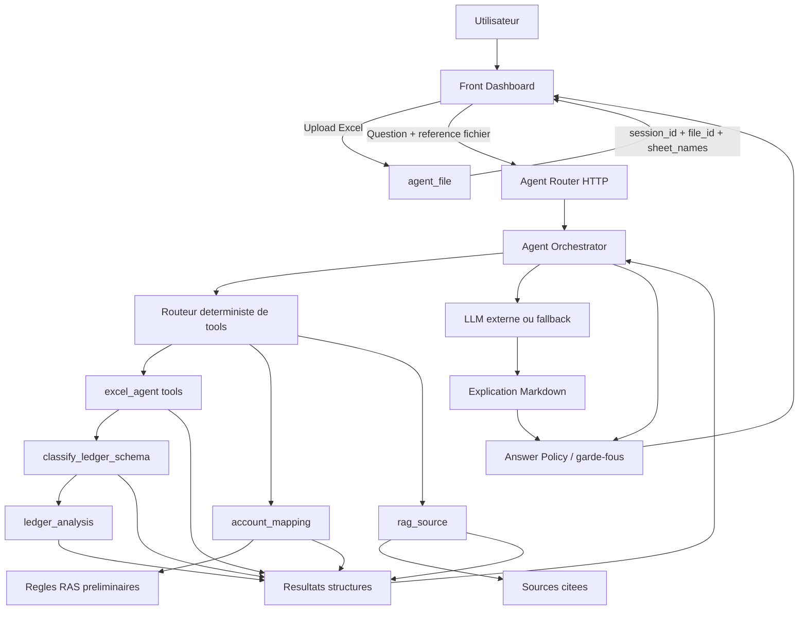
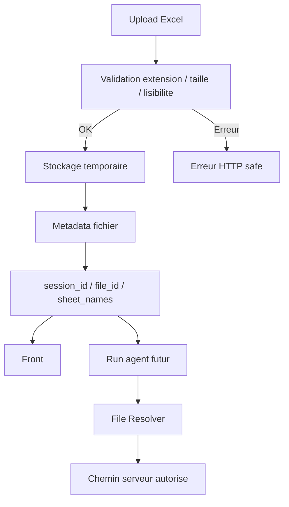
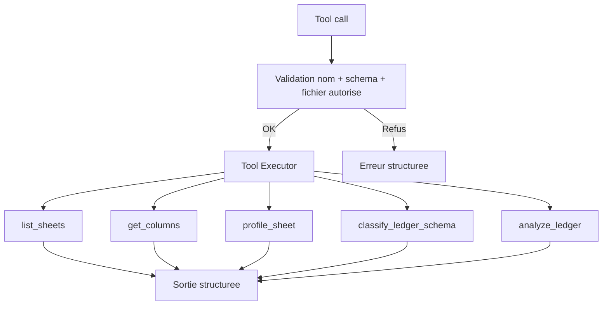
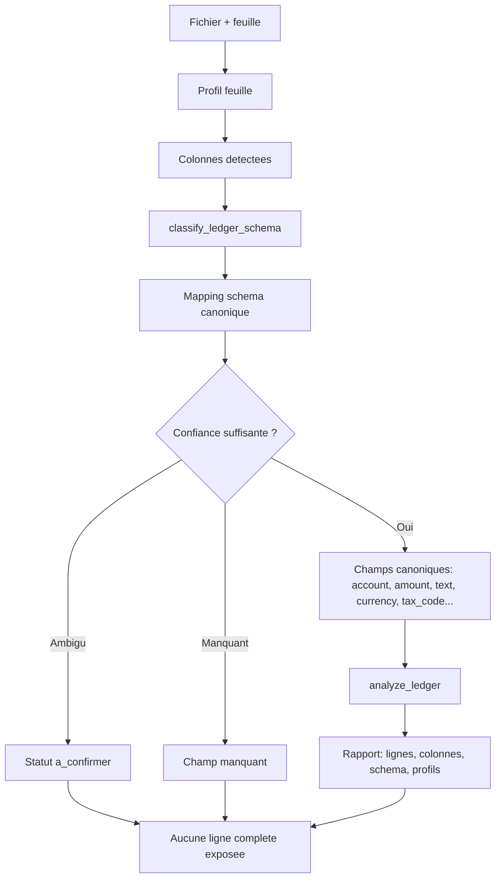
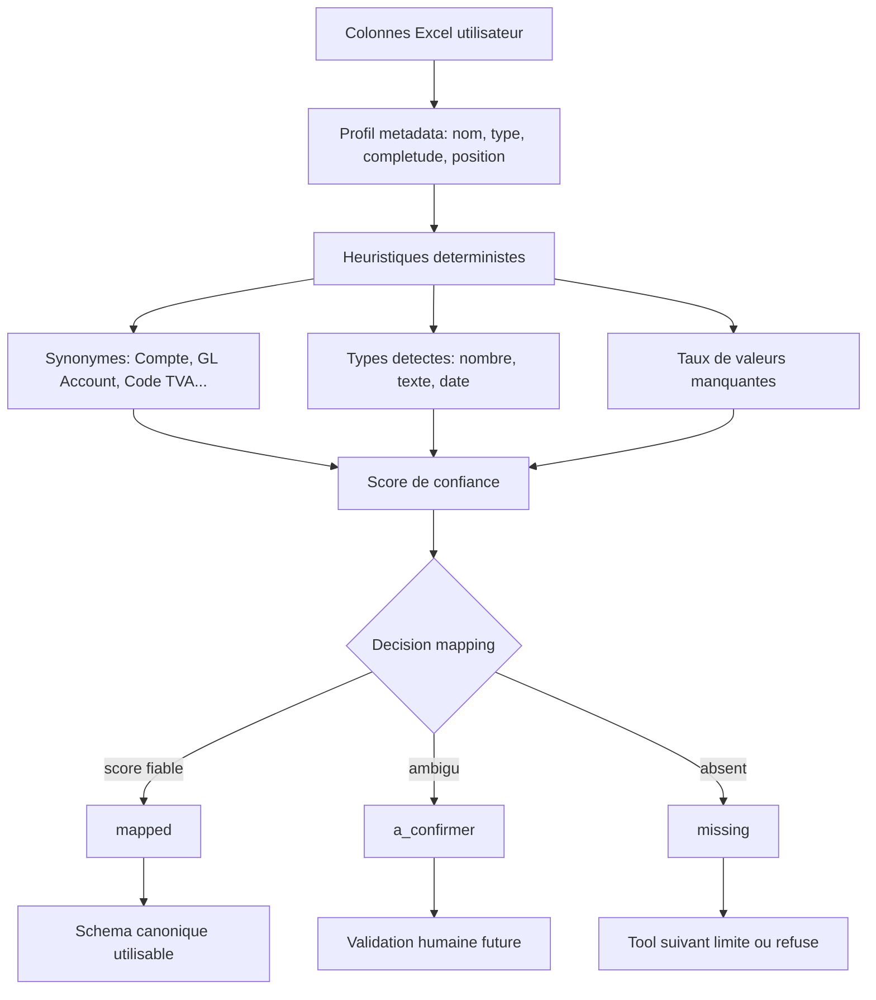
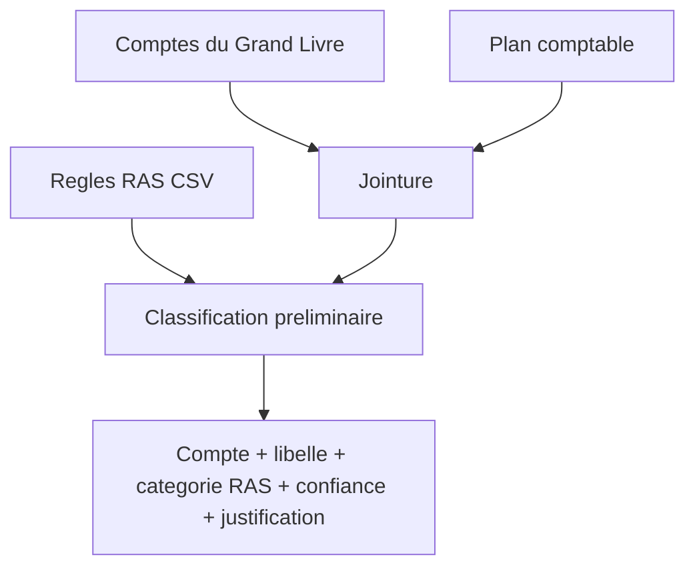
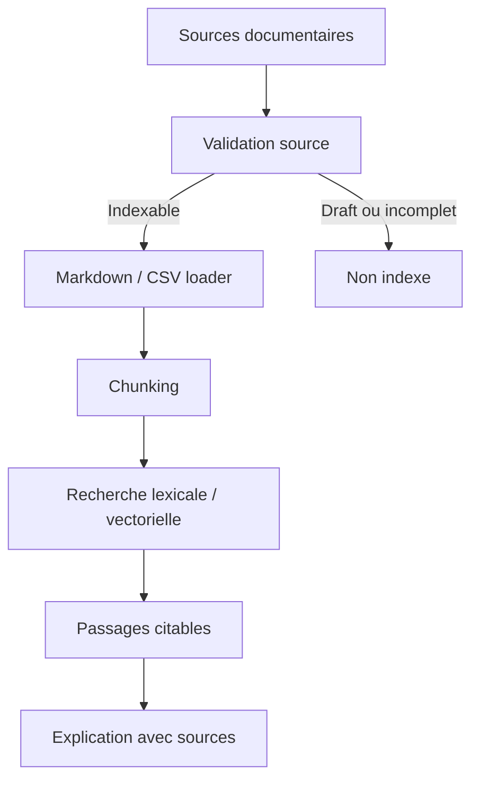
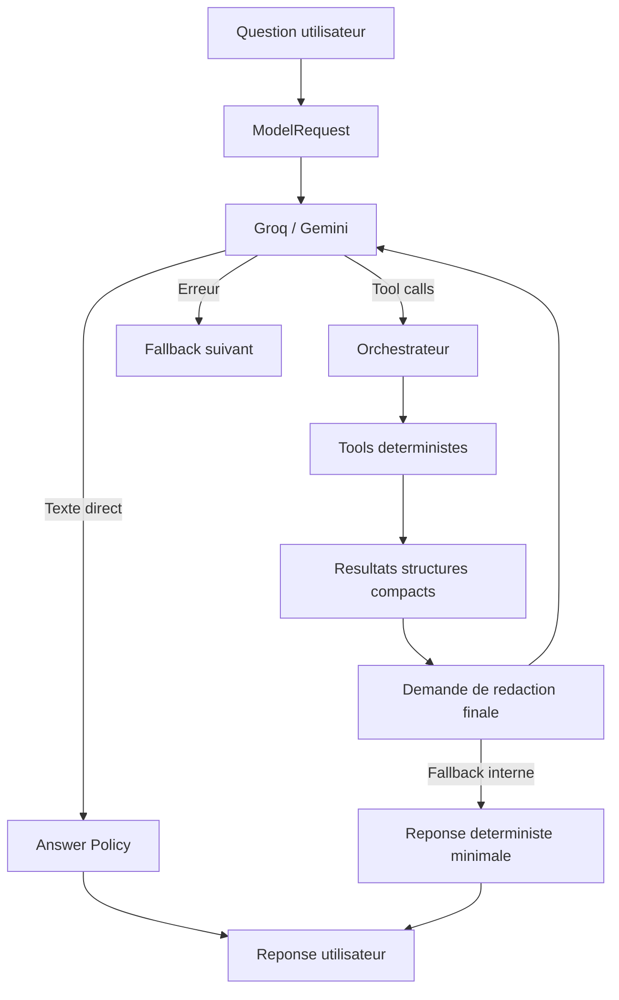
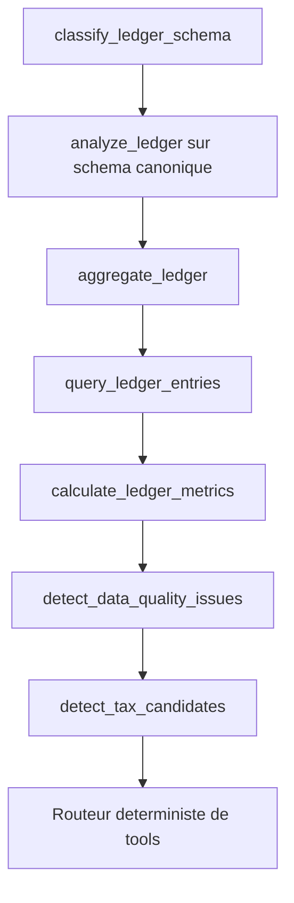

# Schémas Mermaid Agent, Excel, RAG

Objectif: comprendre ce que fait l'IA et ce qu'elle ne fait pas.

Le principe central: **les calculs, lectures Excel, contrôles et classifications restent déterministes**. Le LLM orchestre et explique, mais il ne décide pas seul.

## Vue Globale

Ce que le LLM reçoit: la question, le contexte fichier, les définitions de tools, puis des résultats structurés. Il ne reçoit pas tout l'Excel brut.

## Module `agent_file`

Rôle: recevoir le fichier, le valider, le stocker temporairement, puis fournir une référence safe. Le front ne manipule pas de chemin serveur.

## Module `excel_agent`

Rôle: lire Excel de façon contrôlée. Les tools actuels retournent surtout des métadonnées, profils et schémas, pas les lignes complètes.

## Module `ledger_analysis`

Rôle: comprendre le sens des colonnes d'un Excel utilisateur avant l'analyse. Le LLM ne devine pas: les colonnes sont mappees par heuristiques deterministes avec score de confiance.

## Classification du Schéma Canonique

Objectif: permettre à l'agent de comprendre que `Compte`, `Nº compte` ou `GL Account` peuvent représenter le champ canonique `account`, sans envoyer les lignes brutes au LLM.

## Module `account_mapping`

Rôle: relier les comptes du Grand Livre au plan comptable et produire une classification RAS préliminaire. Ce module ne dépend pas du LLM.

## Module `rag_source`

Rôle: retrouver les sources et citations. Le RAG apporte du contexte documentaire, pas une décision fiscale.

## Orchestration LLM

Rôle: le LLM choisit ou formule, mais les résultats fiables viennent des tools.

## Prochains Tools

Pourquoi le routeur déterministe: une question comme "montre les écritures du compte 44585100" doit appeler `query_ledger_entries`, pas dépendre d'un choix libre du LLM.
