# Logique API Agent Fiscal

Ce document décrit l'architecture API actuelle du projet `fiscal-control-engine`.

## 1. Vue Actuelle

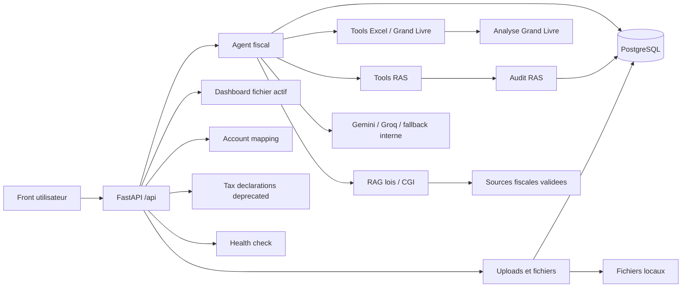

## 2. Flux Upload Fichier

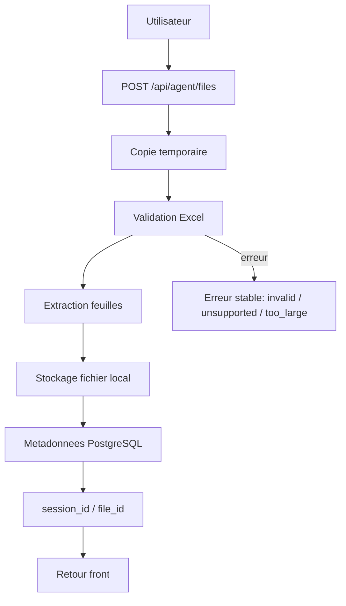

## 3. Flux Question Agent

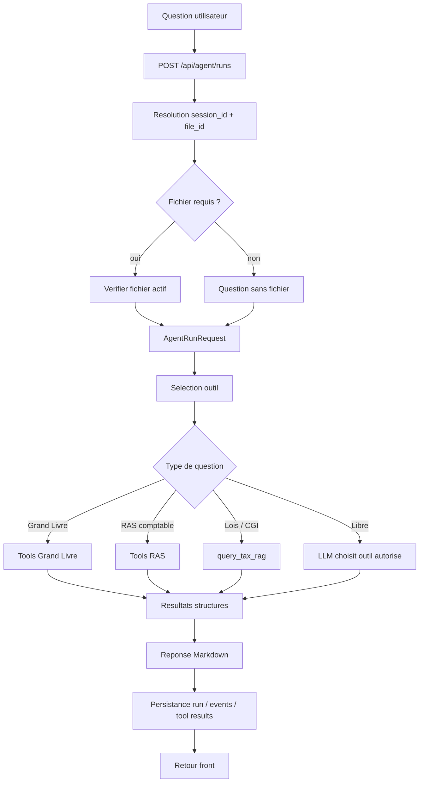

## 4. Grand Livre

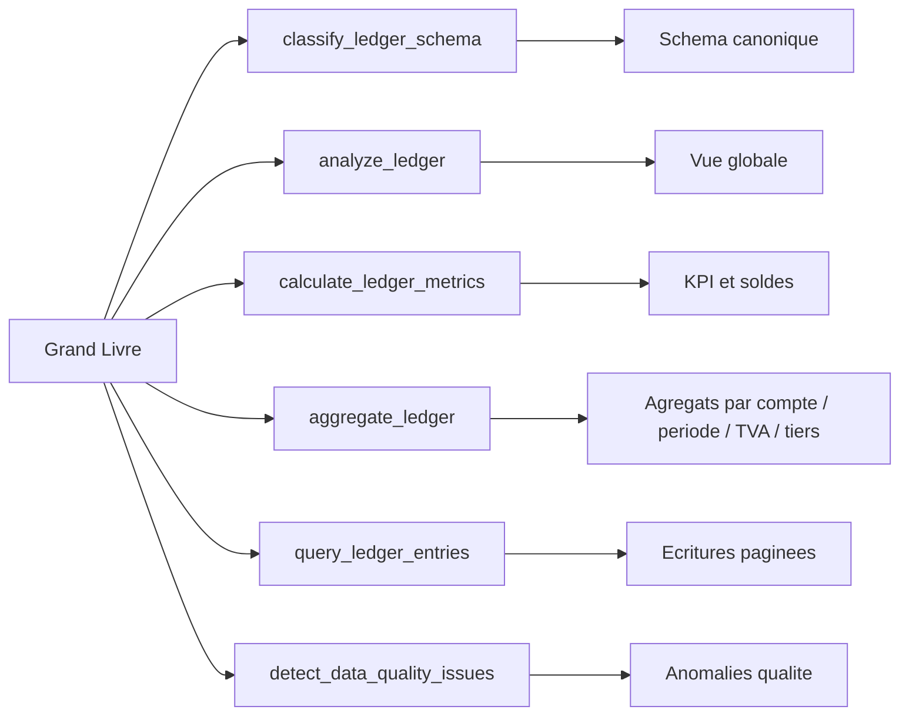

## 5. RAS

RAS signifie `retenue a la source`. Dans l'API, la logique RAS est separee en trois niveaux: reperer les pieces a revoir, verifier la comptabilisation, puis comparer avec la regle fiscale si les faits sont suffisants.

### 5.1 Reperage Des Candidats RAS

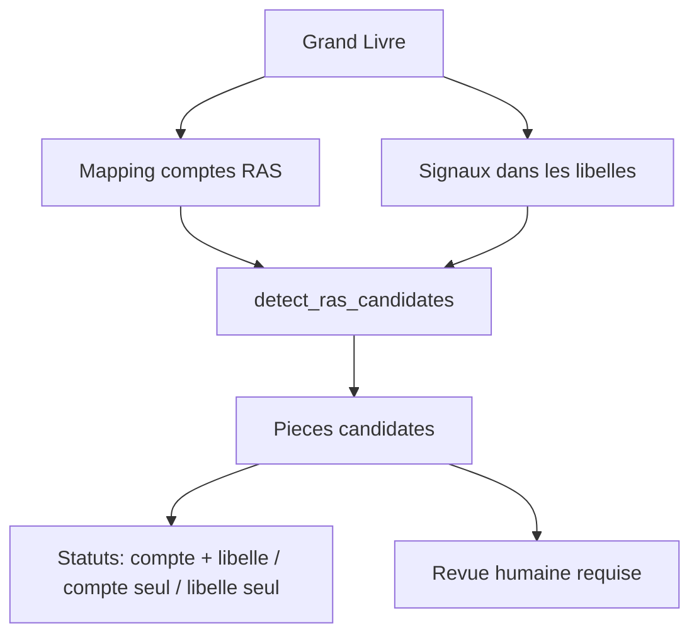

### 5.2 Verification Comptable RAS

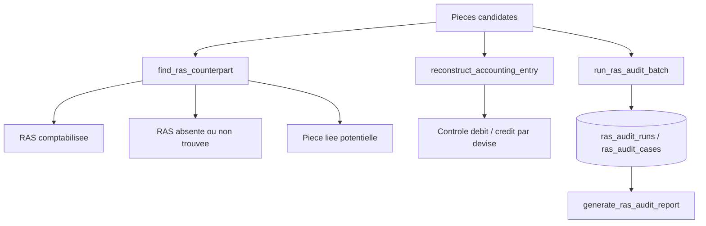

### 5.3 Regle Fiscale Et Calcul

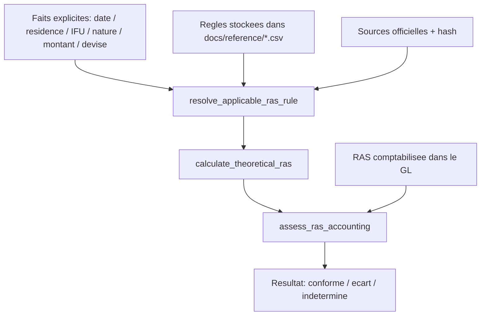

Important: la RAS n'est pas decidee par le LLM. Le LLM peut expliquer. Les tools reperent, calculent et signalent les cas a revoir.

## 6. Lois / CGI / RAG Fiscal

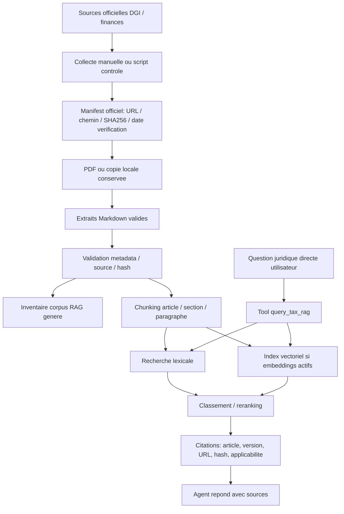

Important: l'API ne cherche pas les lois sur Internet a chaque question. Elle interroge un corpus local deja collecte, valide, versionne et rattache a des sources officielles.

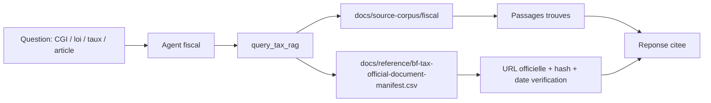

Les references juridiques ont deux usages distincts:

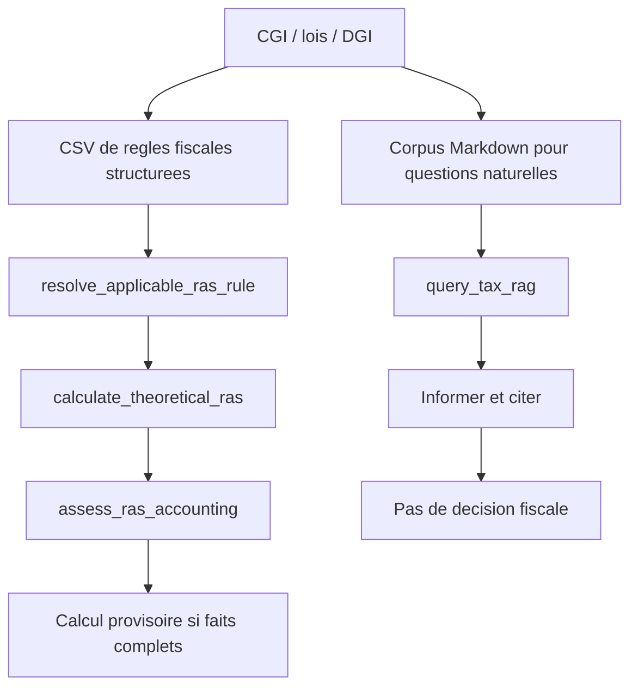

## 6.1 Stockage Des Regles Fiscales

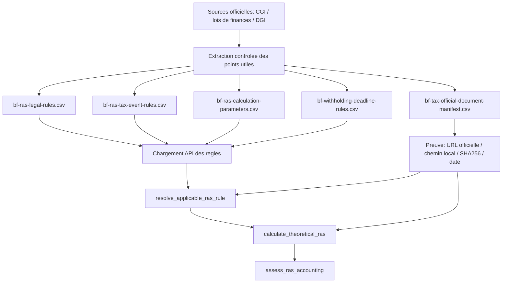

Les regles fiscales calculables sont donc stockees directement dans `docs/reference/*.csv`. Le corpus RAG sert a expliquer et citer; les CSV servent a resoudre une regle et calculer.

## 7. Dashboard Front

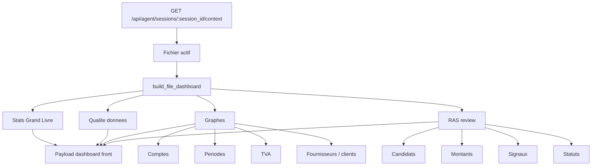

## 8. Persistance

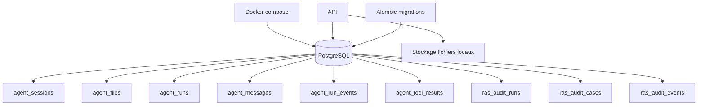

## 9. Architecture Cible A Realigner

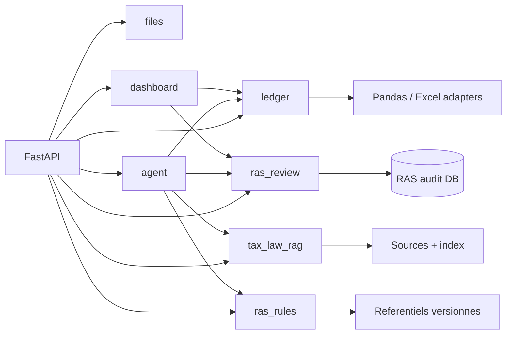

## 10. Point Qui Cloche Aujourd'hui

```mermaid
flowchart TD
    ExcelAgent[excel_agent] --> GL[Grand Livre]
    ExcelAgent --> RAS[RAS]
    ExcelAgent --> RAG[RAG fiscal]
    ExcelAgent --> Audit[Audit RAS]
    ExcelAgent --> Rules[Regles fiscales]

    Orchestrator[agent/orchestrator.py] --> Routing[Routing]
    Orchestrator --> Prompt[Prompts]
    Orchestrator --> Fallback[Fallback]
    Orchestrator --> Answers[Format reponses]
    Orchestrator --> Guardrails[Garde-fous]

    Dashboard[dashboard_service.py] --> Tools[Execution directe de tools]

    Problem[Probleme principal] --> P1[Frontieres metier floues]
    Problem --> P2[Modules trop charges]
    Problem --> P3[Dashboard trop couple aux tools]
    Problem --> P4[RAS / GL / RAG pas assez separes]
```
